# Müll-Erinnerung

## Schon mal vergessen den Mülleimer rauszustellen?

`TrashReminder` erinnert Dich daran, indem es eine farbig blinkende Erinnerung anzeigt!

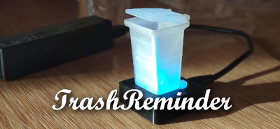

Je nach Müllart blinkt das Mülleimermodell in einer unterschiedlichen Farbe:
- `weiß`: Restmüll
- `blau`: Papier
- `grün`: Biomüll/Häckselgut
- `gelb`: Gelber Sack oder Wertstofftonne

Wird also zum Beispiel `Restmüll` abgeholt, blinkt das Mülleimermodell `weiß`.

Sollten am selben Tag **zwei** unterschiedliche Müllarten abgeholt werden, wechselt das Licht zwischen den entsprechenden Farben hin und her. Also zum Beispiel zwischen `weiß` und `grün`, wenn sowohl `Restmüll` als auch `Biomüll` am selben Tag abgeholt werden.

Durch `Anheben des Mülleimermodells` kann das Warnlicht ausgeschaltet werden um mitzuteilen, dass der Mülleimer rausgestellt wurde.

# Inhaltsverzeichnis

1. [Einrichten der Müllerinnerung](#einrichten-der-m%C3%BCll-erinnerung)
   - [Verbinden mit dem WLAN](#verbinden-mit-dem-wlan)
   - [Herunterladen der Abfuhrdaten](#herunterladen-der-abfuhrdaten)
   - [Speichern der Abfuhrdaten](#speichern-der-abfuhrdaten)
2. [Interaktion mit der Müllerinnerung](#interaktion-mit-der-m%C3%BCllerinnerung)
   - [Anstehende Abholtermine](#anstehende-abholtermine)
   - [Ausschalten der Erinnerung](#ausschalten-der-erinnerung)
3. [Einstellungen](#einstellungen)
   - [Zeitpunkt der Erinnerung](#zeitpunkt-der-erinnerung)
   - [Auswahl der Abfallart und Warnlichtfarbe](#auswahl-der-abfallart-und-warnlichtfarbe)
   - [Optionen](#optionen)
   - [Zeitserver](#zeitserver)
4. [Sonstiges](#sonstiges)
   - [Farbe des Warnlichts und dessen Bedeutung](#farbe-des-warnlichts-und-dessen-bedeutung)
   - [Problembehandlung](#problembehandlung)
   - [Entsorgungsunternehmen](#entsorgungsunternehmen)
   - [Neueste Codeversion](#neueste-codeversion)
     
# Einrichten der Müll-Erinnerung

## Verbinden mit dem WLAN
Da das aktuelle Datum und Uhrzeit aus dem Internet ermittelt werden, muss `TrashReminder` mit dem WLAN verbunden werden.

Wenn `TrashReminder` zum ersten mal ans Netzteil angeschlossen wird, leuchtet das Mülleimermodell dauerhaft `rot` um mitzuteilen, dass die einmalige Einrichtung durchgeführt werden muss.

Hierzu muss man sich über das Smartphone mit dem WLAN Netzwerk `TrashReminder` verbinden und im folgenden Dialog
- Heimnetzwerk (SSID) auswählen und das
- Passwort für dieses Netzwerk eingeben.

Jetzt verbindet sich `TrashReminder` mit dem ausgewählten Netzwerk und quittiert die erfolgreiche Verbindung mit einem `Feuerwerk` im Mülleimermodell. (Sollte die Verbindung fehlschlagen siehe [Problembehandlung](#problembehandlung))

Diese Einrichtung muss nur einmalig durchgeführt werden - von nun an holt sich `TrashReminder` die aktuelle Uhrzeit aus dem Internet und gleicht diese mit eventuell vorliegenden Müllterminen ab, welche dann durch farbiges Blinken des Mülleimermodells mitgeteilt wird.

## Herunterladen der Abfuhrdaten

Die Abfuhrdaten werden üblicherweise durch das [Entsorgungsunternehmen](#entsorgungsunternehmen) auf einer Webseite im `ICS` oder `ICAL` Format bereitgestellt und müssen zuerst heruntergeladen werden. Suche über einen Browser nach "Abfuhrtermine" oder "Abfallkalender" + Deinem Ort, z.B. ["Abfuhrtermine Stuttgart"](https://www.google.com/search?&q=Abfuhrtermine+Stuttgart). Falls mehrere Abfuhrunternehmen die Abholung übernehmen, können auch mehrere Dateien angegeben werden. 

## Speichern der Abfuhrdaten

Hast Du die Abfuhrtermine auf Dein Handy oder Deinen Computer heruntergeladen, müssen diese auf `TrashReminder` gespeichert werden.

Öffne hierzu in Deinem Browser die Adresse [http://TrashReminder](http://TrashReminder).

<kbd>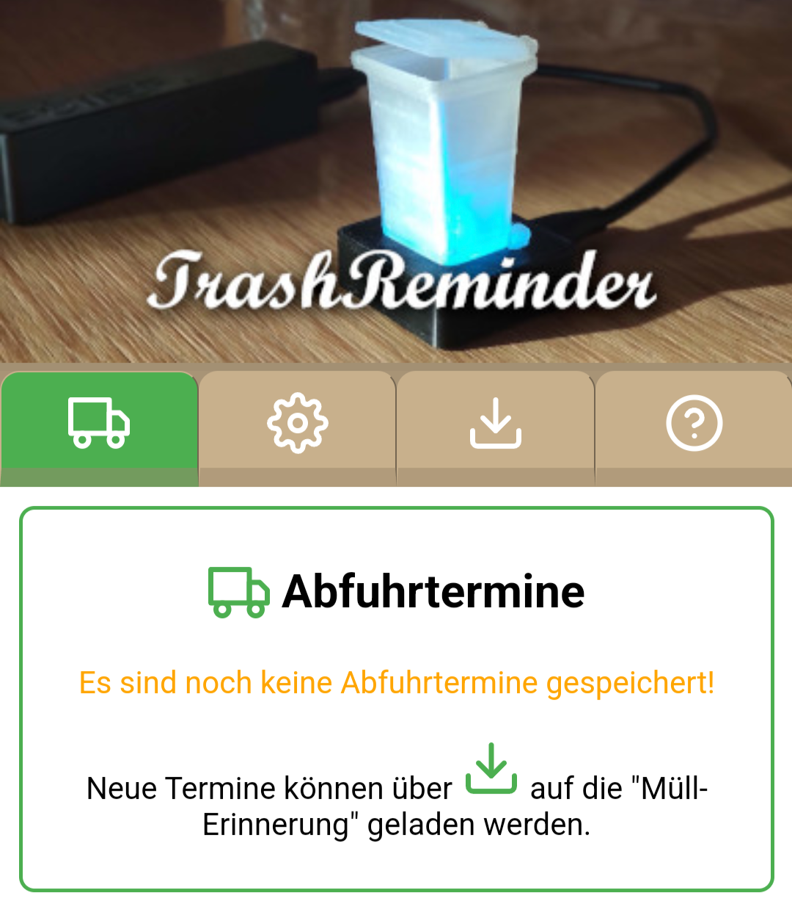</kbd>

Klicke auf das Download-Symbol um zur Download-Seite zu wechseln.

<kbd>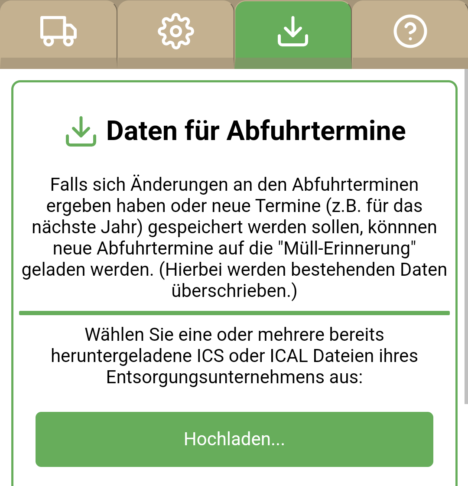</kbd>

Klicke auf `Hochladen...` und wähle eine oder mehrere der heruntergeladenen `ICS`/`ICAL` Dateien aus und bestätige die Auswahl.

Es wird die `Anzahl der gefundenen Termine` und die unterschiedlichen `Müllarten` mit der zugewiesene `Farbe des Warnlichts` angezeigt: 

<kbd>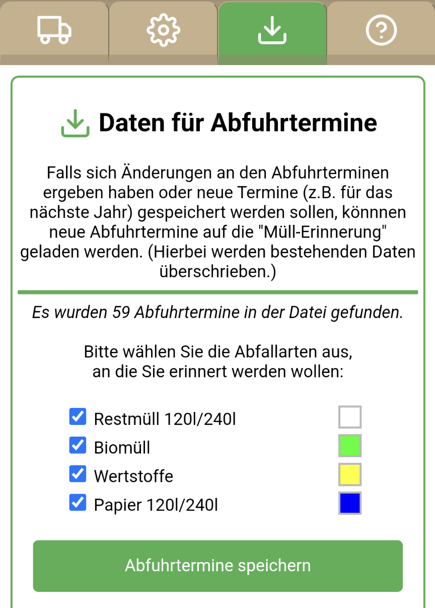</kbd>

Optional kann hier ausgewählt werden an welche Müllarten erinnert werden soll und auch mit welcher Farbe (klicke hierzu auf das Farbkästchen):

<kbd>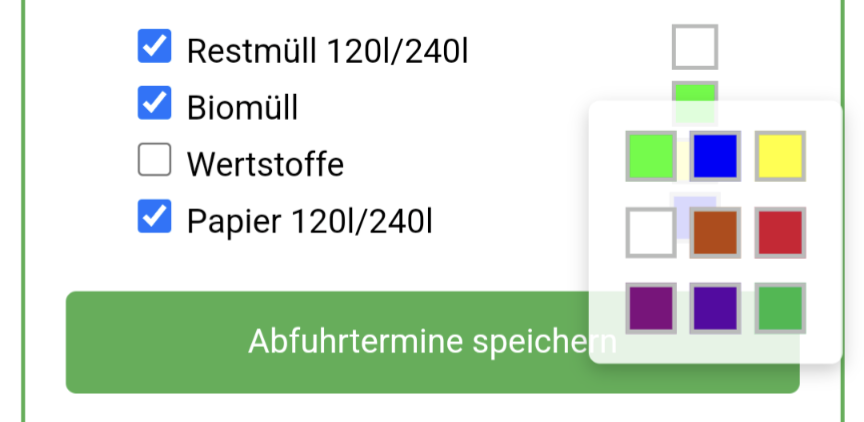</kbd>

Ist alles wie gewünscht gesetzt, klicke auf `Abfuhrtermine speichern`.

Nach erfolgreicher Speicherung wechselt `TrashReminder` automatisch zur Ansicht der `Abfuhrtermine`:

<kbd>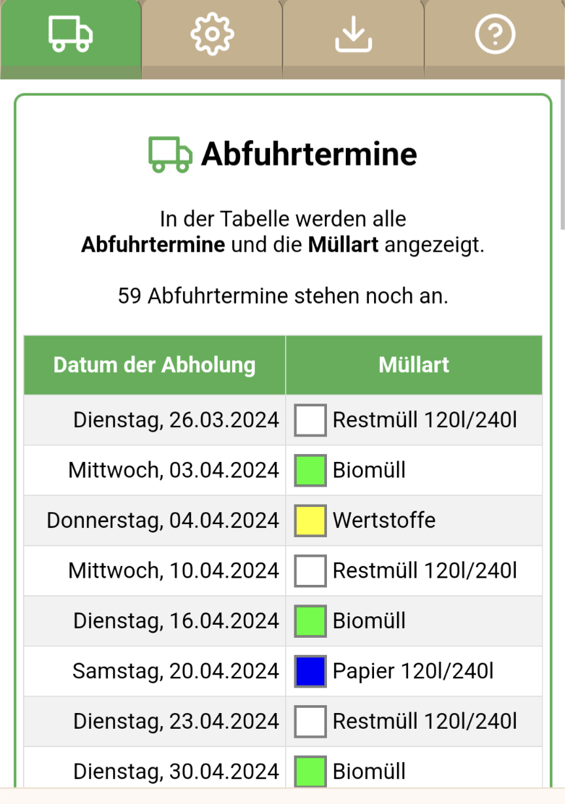</kbd>

Hiermit ist die Einrichtung abgeschlossen - `TrashReminder` wird Dich einen Tag vorher an eine bevorstehende Abholung erinnern!

# Interaktion mit der Müllerinnerung

Du kannst immer über Eingabe der Adresse [http://TrashReminder](http://TrashReminder) auf den `TrashReminder` zugreifen.
Hier kannst Du die anstehenden Abholtermine einsehen, das Blinken ausschalten oder Einstellungen vornehmen.

## Anstehende Abholtermine

Auf der Startseite werden alle anstehenden Abholtermine angezeigt.
Bereits verstrichene Termine werden standardmäßig nicht angezeigt, um schnell den nächsten Termine erkennen zu können. Durch Klick auf den Link `anstehende` Termine, können verstrichene Termine eingeblendet werden.

Liegt eine Erinnerung vor, so blinkt auch der Termin in der Liste und eine Schaltfläche `Mülleimer steht draußen` zum Bestätigen ist eingeblendet. 

## Ausschalten der Erinnerung

Wenn der Müll rausgestellt wurde, kann die Erinnerung auf zwei Arten ausgeschaltet werden:
- indem das **Mülleimermodell kurz angehoben** wird
- über [http://TrashReminder](http://TrashReminder) kann die Schaltfläche `Mülleimer steht draußen` betätigt werden:

<kbd>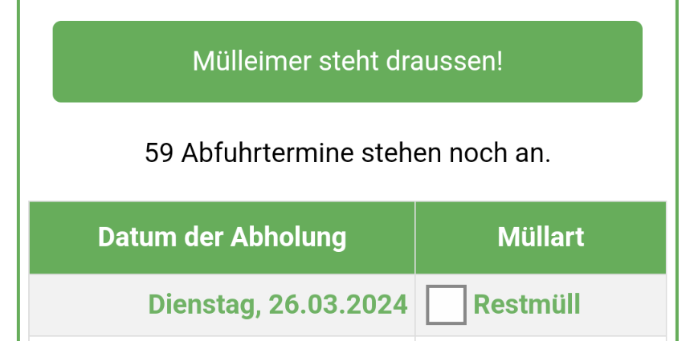</kbd>

Damit erlischt das Licht bis zur nächsten Abholerinnerung.

Wurde die Erinnerung versehentlich ausgeschaltet (aber der Müll nicht rausgestellt) kann man entweder 
- den Stecker der Stromversorgung einfach kurz aus- und wieder einstecken oder
- über [http://TrashReminder](http://TrashReminder) kann die Schaltfläche `Mülleimer steht doch nicht draußen` betätigt werden:

<kbd>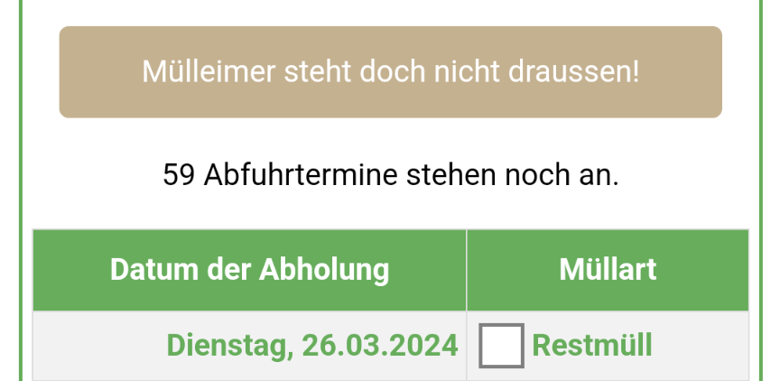</kbd>

Liegt eine aktuelle Erinnerung vor und ist man im Erinnerungszeitraum (15 - 9 Uhr) blinkt das Mülleimermodell wieder wie zuvor.   

# Einstellungen

Um Einstellungen für `TrashReminder` durchzuführen, musst Du in Deinem Browser die Adresse [http://TrashReminder](http://TrashReminder) aufrufen.

Klicke auf das `Zahnrad-Symbol` um zur Einstellungsseite zu wechseln:

<kbd>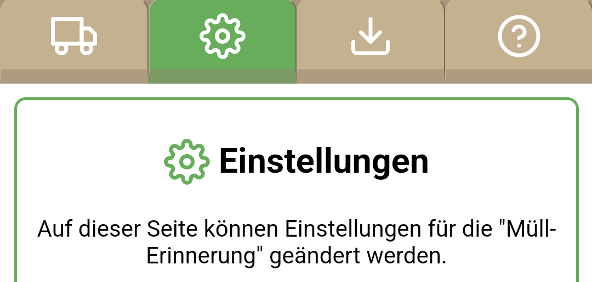</kbd>

> **HINWEIS:**
> Jede Änderung wird sofort auf `TrashReminder` übertragen.

## Zeitpunkt der Erinnerung
Die Erinnerung erfolgt standardmäßig am **Vortag von 15 Uhr bis 9 Uhr morgens**, kann aber wie gewünscht angepasst werden:

<kbd>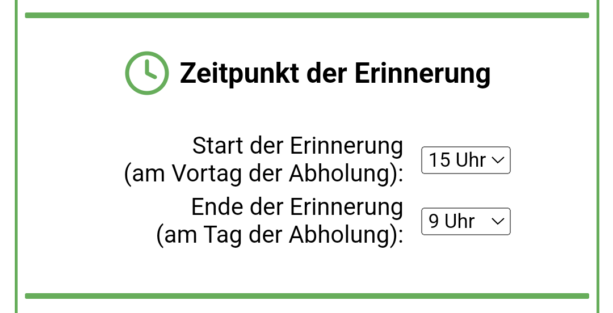</kbd>

## Auswahl der Abfallart und Warnlichtfarbe
Für die abgespeicherten Abholtermine kann eingestellt werden an **welche Abfallarten** erinnert werden soll. Ebenso kann hier auch die Farbe des Warnlichts eingestellt werden.

<kbd>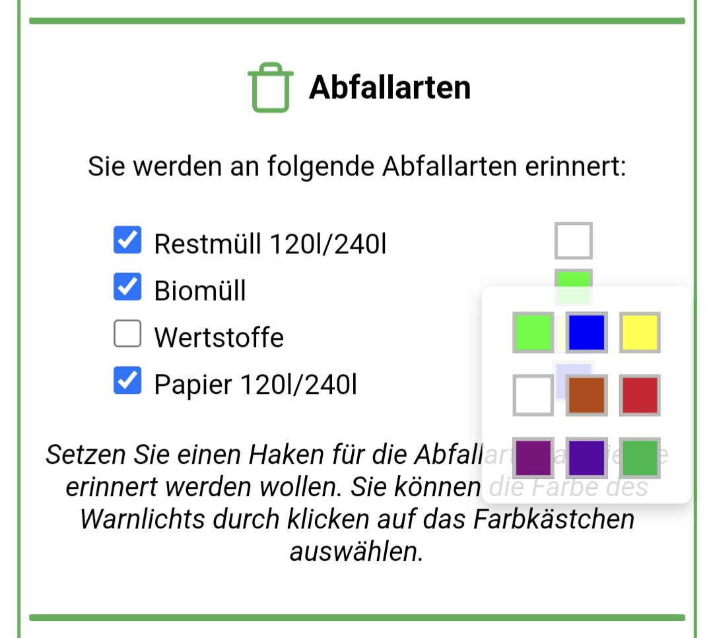</kbd>

## Optionen
Unter Optionen können vergangene Termine eingeblendet werden oder beim Import von Terminen auch bereits verstrichene Termine gespeichert werden:

<kbd>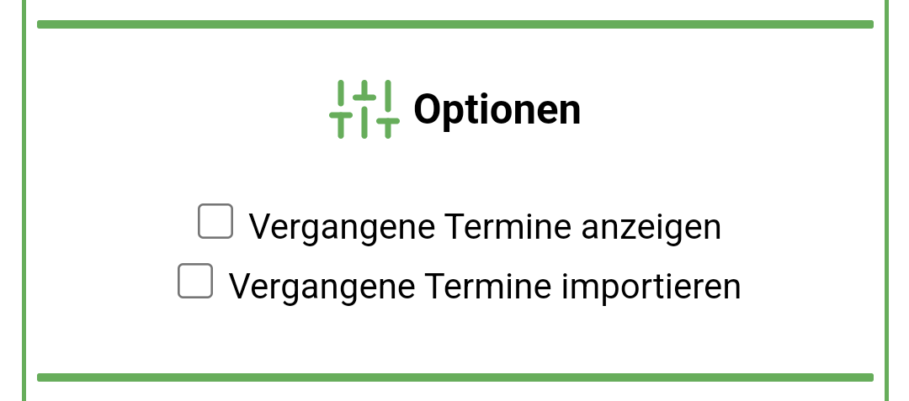</kbd>

## Zeitserver
Änderungen an den Einstellungen werden derzeit noch nicht unterstützt:

<kbd>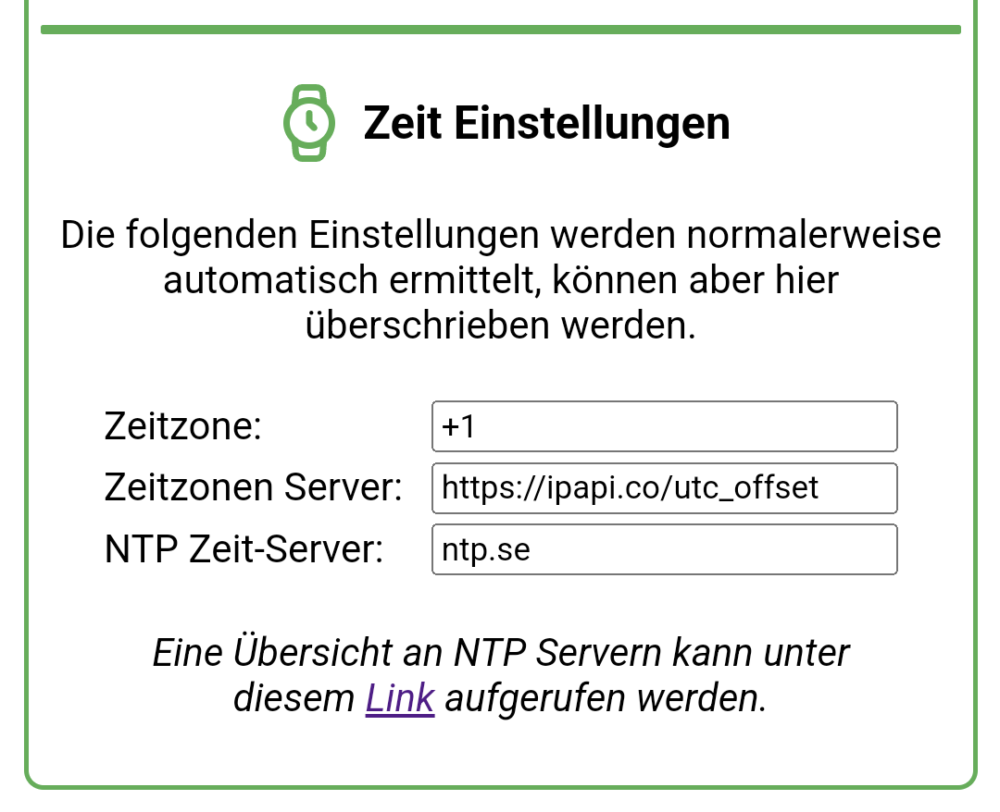</kbd>

# Sonstiges
## Farbe des Warnlichts und dessen Bedeutung

- `rot-dauerhaft` WLAN muss eingerichtet werden
- `rot-blinken-schnell` Keine Verbindung zum WLAN. Sobald Verbindung wieder vorliegt wecheselt `TrashReminder` in den regulären Modus.
- `violett-dauerhaft` Keine Abfuhrtermine vorhanden
- `violett-blinken-schnell` Keine *zukünfigen* Abfuhrtermine vorhanden
- `gelb-dauerhaft` Erste WLAN Verbindung fehlgeschlagen. Erweiterte Verbindungsmöglichkeiten über Netzwerk `TrashReminder`
 
## Problembehandlung
- Konfigurationsseite unter WLAN `TrashReminder` wird nicht angezeigt
  - Versuche `http://192.168.1.4` aufzurufen.
- Einrichtung der WLAN Verbindung fehlgeschlagen
  - Wenn die erste Verbindung mit dem WLAN fehlschlägt, werden beim erneuten Aufruf von WLAN `TrashReminder` erweiterte Optionen eingeblendet um eine IP-Adresse, Subnetmask, etc. angeben zu können. 
- [http://TrashReminder](http://TrashReminder) wird nicht gefunden:
  - Versuche den Link über den Laptop oder ein anderes Smartphone aufzurufen.
  - Versuche einen anderen Browser (manche Browser lassen Verbindungen nicht über `http://` zu)
  - Ermittle die IP-Adresse (192.168.178.x oder ähnlich) der `TrashReminder` und gib sie  in das Browser-Suchfeld ein.
    - Rufe deine Router-Konfiguration (z.B. [http://fritz.box](http://fritz.box)) auf und suche die IP eines Gerätes mit Namen `ESP...`. 
    - Benutze eine Smartphone App wie [Fing](https://play.google.com/store/apps/details?id=com.overlook.android.fing) und suche die IP eines Gerätes mit Namen `ESP...`.  

## Entsorgungsunternehmen
Beispiele für Unternehmen, bei denen ICS Dateien heruntergeladen werden können:

- `Hirrlingen`: <https://www.abfall-kreis-tuebingen.de/online-abfuhrtermine/>
- `Hirrlingen (Bogenschütz)`: <https://www.bogenschuetz-entsorgung.de/blaue-tonne-tuebingen/abfuhrtermine.html>
- `Neuweiler/Böblingen`: <https://www.lrabb.de/start/Service+_+Verwaltung/Abfuhrtermine.html>
- `Stuttgart`:<https://service.stuttgart.de/lhs-services/aws/abfallkalender>
- `Ebhausen`: <https://www.awg-info.de/privatkunden/abfuhrtermine>
- `Rheinbach`: <https://www.rsag.de/abfallkalender/abfuhrtermine>
- `Holzgerlingen`:<https://www.awb-bb.de/start/entsorgen/Abfuhrtermine.html>
- `Hannover`: <https://www.aha-region.de/abholtermine/abfuhrkalender>

## Neueste Codeversion
Wenn Du die neueste Codeversion auf Deinen `TrashReminder` laden willst, kannst Du folgende Schritte ausführen:
- Schließe Deinen `TrashReminder` über ein **Daten**-USB-Kabel an Deinen Computer an
- Öffne über Chrome, Edge oder Opera folgende Seite: <https://tobiwern.github.io/TrashReminder_V3/flash.html>
- Führe `Neuesten Code Herunterladen` aus
- Wähle den COM-Port aus, an dem der `TrashReminder` angeschlossen ist und folge den Anweisungen.

# Autor
Tobias Werner, Erfindungen aller Art
